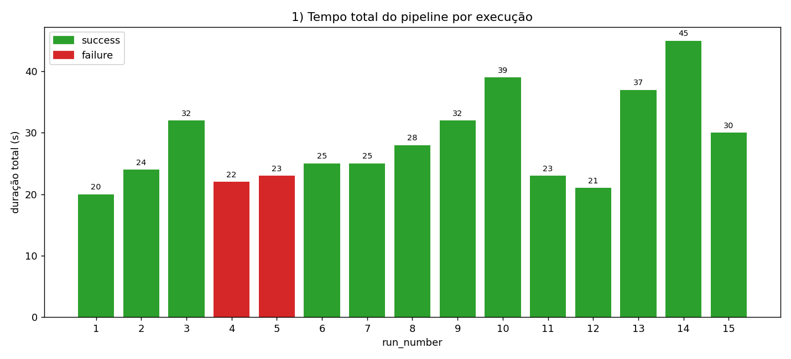
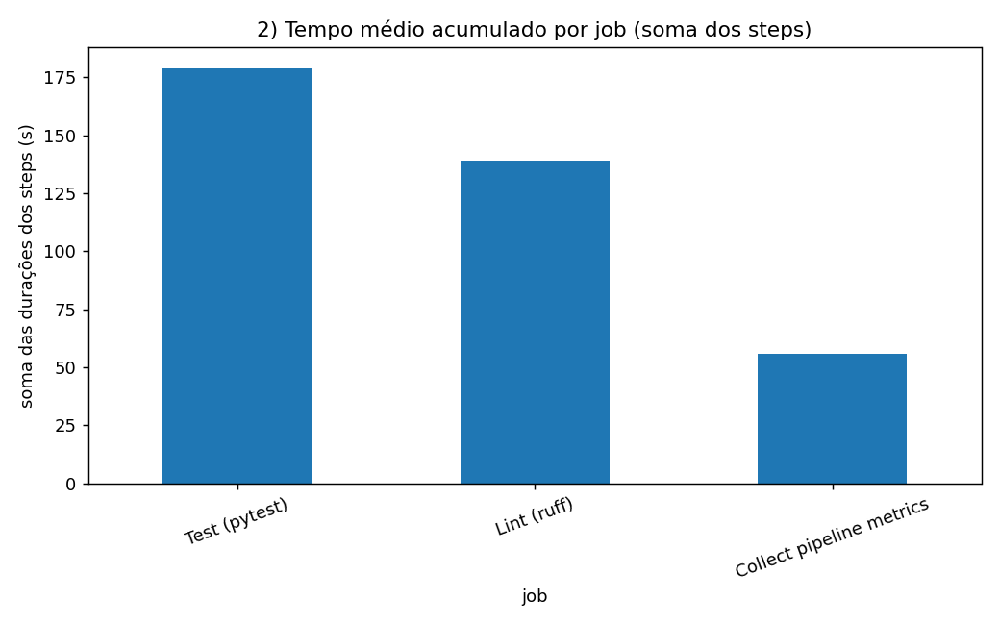
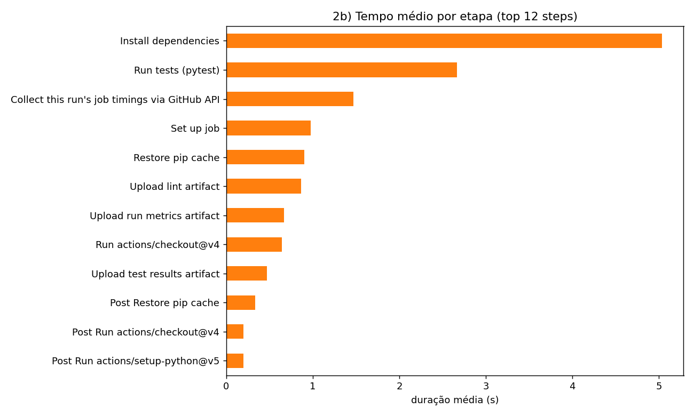
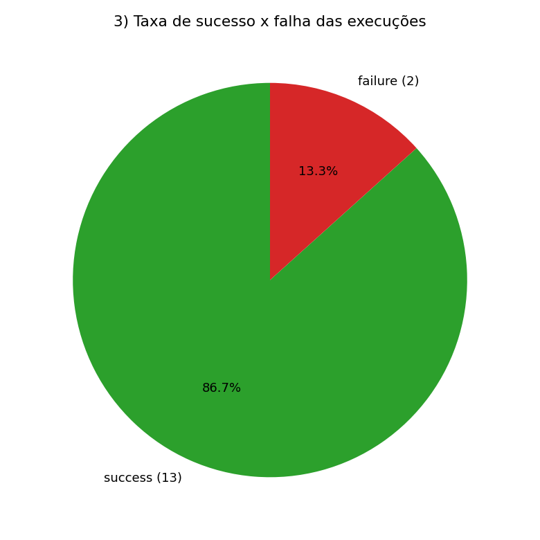
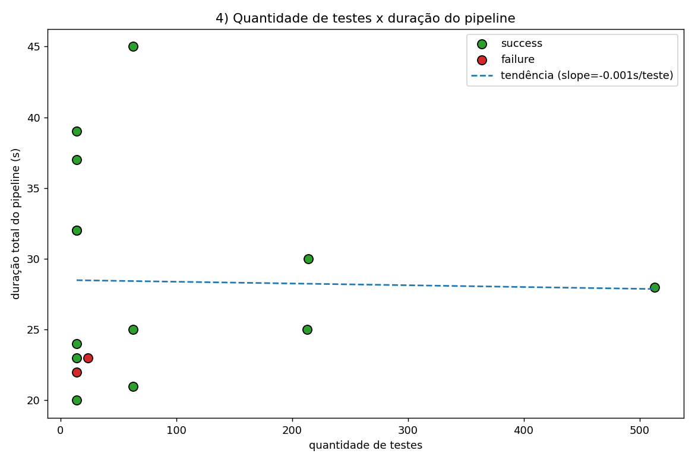

# Relatório Técnico — Coleta e Análise de Métricas em Pipeline CI/CD

**Autor:** ryanbotgar
**Repositório:** <https://github.com/ryanbotgar/ci-cd-metrics-experiment>
**Workflow (YAML):** <https://github.com/ryanbotgar/ci-cd-metrics-experiment/blob/main/.github/workflows/ci.yml>
**Plataforma:** GitHub Actions (`ubuntu-latest`, Python 3.12)
**Execuções analisadas:** 15 runs reais (run_number 1 a 15)
**Data do experimento:** 2026-06-08 (UTC)

---

## 1. Objetivo e desenho do experimento

O objetivo foi **instrumentar** um pipeline CI/CD real no GitHub Actions, **coletar
métricas** de execuções reais via API do GitHub, **armazenar** os dados em formato
estruturado (CSV/JSON), **gerar gráficos** e produzir uma **análise crítica** sobre
desempenho, estabilidade e gargalos.

O projeto-alvo é uma pequena biblioteca Python (`src/calc`) com testes em `pytest`.
O pipeline (`.github/workflows/ci.yml`) possui três jobs:

| Job | Função |
|-----|--------|
| `lint` | instala dependências, roda **ruff** (análise estática), publica artefato `lint-report` |
| `test` | instala dependências (com/sem cache), roda **pytest** com `--junitxml` e `--json-report`, publica artefato `test-results` |
| `metrics` | consulta a **API do GitHub** (`gh api .../jobs`) para o próprio run e publica artefato `run-metrics` |

Assim o pipeline cumpre os requisitos mínimos: instalação de dependências, análise
estática, execução de testes, geração de artefato e coleta de métricas.

### Hipóteses iniciais

| # | Hipótese |
|---|----------|
| H1 | A etapa de **execução de testes** será a que mais contribui para o tempo total. |
| H2 | Habilitar o **cache de dependências** reduzirá perceptivelmente o tempo do pipeline. |
| H3 | **Paralelizar** os jobs reduzirá o tempo total em relação à execução sequencial. |
| H4 | Aumentar a **quantidade de testes** aumentará a duração do pipeline de forma aproximadamente linear. |
| H5 | Introduzir um **teste lento** aumentará o tempo total proporcionalmente ao `sleep`. |

---

## 2. Variações controladas

Foram executadas **15 runs**. Cada variação altera código (testes gerados) ou
configuração (cache, paralelismo) de forma controlada, conforme exigido. As variações
são definidas em `scripts/run_experiment.py` e aplicadas automaticamente (commit+push),
o que torna o experimento reproduzível.

| run | Variação | Tipo de variação | Cache | Jobs | Δ código/config |
|----:|----------|------------------|:-----:|:----:|-----------------|
| 1 | bootstrap | commit inicial | on | paralelo | projeto base |
| 2 | baseline-1 | teste passando | on | paralelo | — |
| 3 | baseline-2 | teste passando (repetição) | on | paralelo | — |
| 4 | failing-1 | **teste falhando** | on | paralelo | teste que falha |
| 5 | failing-2 | teste falhando + 10 testes | on | paralelo | falha + 10 testes |
| 6 | more-tests-50 | **+50 testes** | on | paralelo | 63 testes |
| 7 | more-tests-200 | +200 testes | on | paralelo | 213 testes |
| 8 | more-tests-500 | +500 testes | on | paralelo | 513 testes |
| 9 | slow-test-5s | **teste lento (5s)** | on | paralelo | `sleep(5)` |
| 10 | slow-test-15s | teste lento (15s) | on | paralelo | `sleep(15)` |
| 11 | no-cache-1 | **cache desligado** | off | paralelo | sem cache |
| 12 | no-cache-2 | cache desligado + 50 testes | off | paralelo | sem cache, 63 testes |
| 13 | sequential-1 | **jobs sequenciais** | on | sequencial | `test needs: [lint]` |
| 14 | sequential-2 | sequenciais + 50 testes | on | sequencial | sequencial, 63 testes |
| 15 | combo | +200 + lento + sem cache | off | paralelo | combinação |

---

## 3. Evidências reais das execuções

> Atende ao requisito de **prints/links das execuções reais**, **IDs reais dos
> workflows** e **commits reais**. Todos os links abaixo apontam para execuções
> reais no GitHub Actions; os `run_id` e `commit_sha` foram coletados via API.

| run | run_id (real) | commit_sha | status | dur. total (s) | nº testes | falhas | link |
|----:|--------------|-----------|--------|---------------:|----------:|-------:|------|
| 1 | `27115487508` | `a0dae0c` | ✅ success | 20 | 14 | 0 | [run](https://github.com/ryanbotgar/ci-cd-metrics-experiment/actions/runs/27115487508) |
| 2 | `27115524607` | `63f3a1c` | ✅ success | 24 | 14 | 0 | [run](https://github.com/ryanbotgar/ci-cd-metrics-experiment/actions/runs/27115524607) |
| 3 | `27115535197` | `f366a4b` | ✅ success | 32 | 14 | 0 | [run](https://github.com/ryanbotgar/ci-cd-metrics-experiment/actions/runs/27115535197) |
| 4 | `27115546164` | `70b7731` | ❌ failure | 22 | 14 | 1 | [run](https://github.com/ryanbotgar/ci-cd-metrics-experiment/actions/runs/27115546164) |
| 5 | `27115557184` | `6a1e0ee` | ❌ failure | 23 | 24 | 1 | [run](https://github.com/ryanbotgar/ci-cd-metrics-experiment/actions/runs/27115557184) |
| 6 | `27115567979` | `f97f206` | ✅ success | 25 | 63 | 0 | [run](https://github.com/ryanbotgar/ci-cd-metrics-experiment/actions/runs/27115567979) |
| 7 | `27115578063` | `708d02b` | ✅ success | 25 | 213 | 0 | [run](https://github.com/ryanbotgar/ci-cd-metrics-experiment/actions/runs/27115578063) |
| 8 | `27115588790` | `52b336a` | ✅ success | 28 | 513 | 0 | [run](https://github.com/ryanbotgar/ci-cd-metrics-experiment/actions/runs/27115588790) |
| 9 | `27115598414` | `3371491` | ✅ success | 32 | 14 | 0 | [run](https://github.com/ryanbotgar/ci-cd-metrics-experiment/actions/runs/27115598414) |
| 10 | `27115608784` | `40aa598` | ✅ success | 39 | 14 | 0 | [run](https://github.com/ryanbotgar/ci-cd-metrics-experiment/actions/runs/27115608784) |
| 11 | `27115618689` | `3e04241` | ✅ success | 23 | 14 | 0 | [run](https://github.com/ryanbotgar/ci-cd-metrics-experiment/actions/runs/27115618689) |
| 12 | `27115631119` | `9df5968` | ✅ success | 21 | 63 | 0 | [run](https://github.com/ryanbotgar/ci-cd-metrics-experiment/actions/runs/27115631119) |
| 13 | `27115641242` | `95bccab` | ✅ success | 37 | 14 | 0 | [run](https://github.com/ryanbotgar/ci-cd-metrics-experiment/actions/runs/27115641242) |
| 14 | `27115651151` | `5d0e2b8` | ✅ success | 45 | 63 | 0 | [run](https://github.com/ryanbotgar/ci-cd-metrics-experiment/actions/runs/27115651151) |
| 15 | `27115660590` | `24737ab` | ✅ success | 30 | 214 | 0 | [run](https://github.com/ryanbotgar/ci-cd-metrics-experiment/actions/runs/27115660590) |

Lista geral de execuções: <https://github.com/ryanbotgar/ci-cd-metrics-experiment/actions>

---

## 4. Coleta e armazenamento das métricas

A coleta é feita por `scripts/collect_metrics.py`, que **consulta a API do GitHub**
(`/repos/{repo}/actions/runs`, `.../jobs`, `.../artifacts`), calcula durações a partir
dos timestamps `started_at`/`completed_at` e baixa o artefato `test-results` para ler
`report.json` (pytest-json-report) — de onde saem `test_count`, `test_failures` e o
tempo médio dos testes. **Nenhum dado foi copiado manualmente da interface.**

Saídas em `data/`:

- `data/metrics.csv` — uma linha por *(run, job)*, no schema pedido:
  `run_id,commit_sha,commit_message,status,workflow_duration,job_name,job_duration,test_count,test_failures,timestamp`
- `data/runs.csv` — agregado por execução (inclui tempo médio dos testes, tentativa, URL).
- `data/steps.csv` — uma linha por etapa (tempo de cada step relevante).
- `data/metrics.json` — estrutura completa aninhada (run → jobs → steps).

Métricas mínimas exigidas e onde estão: tempo total do workflow (`workflow_duration`),
tempo de cada job (`job_duration`), tempo de cada etapa (`steps.csv`), status
(`status`), nº de testes (`test_count`), falhas (`test_failures`), tempo médio dos
testes (`test_mean_duration` em `runs.csv`), commit (`commit_sha`), data/hora
(`timestamp`/`run_started_at`) e mensagem do commit (`commit_message`).

---

## 5. Gráficos

### 5.1 Tempo total do pipeline por execução



### 5.2 Tempo por job e por etapa





### 5.3 Taxa de sucesso x falha



### 5.4 Quantidade de testes x duração do pipeline



---

## 6. Análise — respostas às perguntas

### 6.1 Qual etapa mais contribuiu para o tempo total do pipeline?

A etapa **`Install dependencies`** foi a maior contribuinte, com **média ≈ 4,8 s**
(chegando a 7 s sem cache), seguida por **`Run tests (pytest)`** (≈ 2,6 s na média,
puxada pelas variações com teste lento). Etapas de infraestrutura (`Set up job`,
`checkout`, `setup-python`, upload de artefatos) somam, cada uma, menos de 1 s. Ou
seja, o custo dominante é **preparação do ambiente**, não a execução dos testes em si.

### 6.2 Houve diferença significativa entre execuções com e sem cache?

**Não — e esse foi um resultado contra-intuitivo.** Comparando pares equivalentes:

- 14 testes: baseline com cache ≈ 25 s (runs 2–3) × sem cache 23 s (run 11);
- 63 testes: com cache 25 s (run 6) × sem cache 21 s (run 12).

No detalhe da etapa de instalação: cache **on** = 4,82 s médios × cache **off** = 5,62 s.
O cache economiza ~0,8 s na instalação, **mas a própria etapa `Restore pip cache`
custa ~1,23 s**. Como as dependências são poucas e leves, o overhead de restaurar o
cache praticamente anula (ou supera) o ganho. Cache só compensaria com árvores de
dependências grandes.

### 6.3 O paralelismo reduziu o tempo total? Em que condições?

**Sim.** Comparando pares equivalentes (mesma quantidade de testes e cache):

- 14 testes: paralelo ≈ 25 s (runs 1–3) × **sequencial 37 s** (run 13) → +48% sequencial;
- 63 testes: paralelo 25 s (run 6) × **sequencial 45 s** (run 14) → +80% sequencial.

Na média geral, paralelo = 27 s × sequencial = 34 s. O ganho aparece porque `lint` e
`test` têm custo de *setup* semelhante; rodando ao mesmo tempo, o tempo total se
aproxima do maior dos dois jobs, em vez da soma. O paralelismo compensa **quando os
jobs são independentes e têm duração comparável** — exatamente este caso.

### 6.4 Quais falhas foram mais frequentes?

Houve **2 falhas em 15 execuções (13,3%)**, ambas do tipo **falha de teste**
(`assert add(2,2)==5`), nas variações `failing-1` (run 4) e `failing-2` (run 5).
Não houve falhas de lint nem de infraestrutura — coerente, pois o lint passou em
todos os commits e o ambiente foi estável. Logo, a única classe de falha observada foi
**falha funcional detectada pelos testes**, que é justamente o comportamento desejado
do pipeline (barrar código quebrado).

### 6.5 O pipeline fornece feedback rápido o suficiente?

**Sim.** O tempo total ficou entre **20 s e 45 s** (mediana ≈ 25 s). Mesmo a pior
execução (sequencial com 63 testes, 45 s) está bem abaixo do limiar usual de
"feedback rápido" (~10 min). Para um desenvolvedor, receber verde/vermelho em menos de
1 minuto é excelente e incentiva ciclos curtos de commit.

### 6.6 Que melhorias poderiam ser feitas no pipeline?

1. **Reavaliar o cache:** para este projeto ele não ajuda; só faz sentido reativá-lo se
   a árvore de dependências crescer.
2. **Manter jobs paralelos** e adicionar uma matriz (ex.: várias versões de Python)
   sem perder o feedback rápido.
3. **Fail-fast no lint** antes de subir o ambiente de teste, para abortar mais cedo.
4. **Concurrency group** para cancelar runs antigos do mesmo branch e poupar minutos.
5. **Cobertura/relatório de testes** publicado como artefato/summary para enriquecer as
   métricas.
6. Migrar as actions para **Node 24** (há *deprecation warnings* de Node 20 nos logs).

### 6.7 Quais limitações existem nos dados coletados?

- **Granularidade de tempo:** a API expõe `started_at`/`completed_at` com resolução de
  **segundos**, o que adiciona ruído de ±1 s — relevante num pipeline que dura ~25 s.
- **Tempo de fila não isolado:** `workflow_duration` (=`updated_at − run_started_at`)
  pode incluir espera por *runner*; pushes próximos competiram por concorrência.
- **Amostra pequena:** 1–3 repetições por variação não permitem testes estatísticos
  robustos; há variância entre runs idênticos (ex.: baseline 20/24/32 s).
- **Confounding:** grupos cache/paralelismo não são perfeitamente balanceados (runs
  lentos e sequenciais concentram-se no grupo "cache on"), por isso a análise usa
  **pares equivalentes** em vez das médias globais.
- **Métrica do job `metrics`:** ele coleta os timings durante a execução, então sua
  própria duração não é final — usamos a coleta *pós-execução* via API como fonte
  canônica.

### 6.8 Como essa análise poderia apoiar decisões de engenharia?

- **Priorizar otimização onde dói:** os dados mostram que mexer no *setup/instalação*
  traria mais ganho do que otimizar os testes — evita esforço mal direcionado.
- **Decidir sobre cache com base em evidência**, não em senso comum (aqui, desligar o
  cache seria defensável).
- **Justificar paralelismo** com número concreto (~20–80% de redução).
- **Monitorar estabilidade** (taxa de falha, nº de tentativas até verde) como indicador
  de saúde do processo e *lead time* de entrega.

---

## 7. Resultados inesperados (mín. 2)

**Inesperado #1 — O cache de dependências não acelerou (chegou a atrasar).**
A hipótese H2 era que o cache reduziria o tempo. Observou-se o contrário em pares
equivalentes (sem cache foi 2–4 s **mais rápido**). Causa: a etapa `Restore pip cache`
(~1,23 s) custa mais do que economiza na instalação de dependências mínimas. Lição:
cache tem overhead fixo e só compensa acima de certo volume de dependências.

**Inesperado #2 — A quantidade de testes quase não afeta a duração.**
A hipótese H4 previa crescimento aproximadamente linear. Mas de **14 → 513 testes** o
tempo total foi de 24 s → 28 s, e a **correlação entre nº de testes e duração foi
−0,093** (praticamente nula). O gráfico 5.4 mostra a reta de tendência plana
(slope ≈ −0,001 s/teste). Causa: os testes gerados são triviais (assert simples), então
a coleta/execução é dominada pelo *overhead* fixo do pipeline, não pelo volume de testes.

---

## 8. Hipótese inicial × resultado observado

| # | Hipótese inicial | Resultado observado | Veredito |
|---|------------------|---------------------|----------|
| H1 | Testes seriam a etapa mais cara | **Instalação de dependências** foi a mais cara (~4,8 s) | ❌ Refutada |
| H2 | Cache reduziria o tempo | Cache foi **neutro/negativo** (overhead de restore) | ❌ Refutada |
| H3 | Paralelismo reduziria o tempo | Confirmado: −20% (geral) a −80% (par equivalente) | ✅ Confirmada |
| H4 | Mais testes → tempo linearmente maior | Correlação ≈ **0** (testes triviais) | ❌ Refutada |
| H5 | Teste lento aumenta o tempo ∝ sleep | Confirmado: +5 s → +8 s; +15 s → +15 s no total | ✅ Confirmada |

---

## 9. Discussão sobre limitações do experimento

- **Ambiente compartilhado:** os *runners* hospedados do GitHub têm desempenho
  variável; parte da variância (baseline 20–32 s) vem da infraestrutura, não do código.
- **Projeto-alvo sintético:** dependências mínimas e testes triviais maximizam o peso
  do *overhead* fixo; um projeto real (com NumPy, build, etc.) provavelmente inverteria
  algumas conclusões (cache passaria a compensar, testes pesariam mais).
- **Variável de confusão temporal:** as 15 execuções ocorreram em poucos minutos; picos
  de fila/concorrência podem ter afetado runs específicos.
- **Resolução e amostragem:** segundos de granularidade + poucas repetições limitam a
  significância estatística; as conclusões são **tendências**, não medições de precisão.
- **Escopo das falhas:** só foram induzidas falhas funcionais de teste; não se exploraram
  falhas de rede, timeout ou flakiness, que existiriam em produção.

---

## 10. Como reproduzir

```bash
git clone https://github.com/ryanbotgar/ci-cd-metrics-experiment
cd ci-cd-metrics-experiment

# (opcional) rodar testes/lint localmente
python -m venv .venv && source .venv/bin/activate
pip install -r requirements-dev.txt
python scripts/gen_tests.py && ruff check src tests && pytest

# disparar as 14 variações (faz commit+push de cada -> dispara o CI)
python scripts/run_experiment.py --sleep 18

# coletar métricas reais via API do GitHub e gerar a base
pip install -r requirements-analysis.txt
python scripts/collect_metrics.py --repo <OWNER>/<REPO> --workflow ci.yml --limit 30

# gerar os gráficos
python scripts/visualize.py
```

---

## 11. Entregáveis (checklist)

- [x] Link do repositório GitHub — topo do relatório
- [x] Link do YAML do GitHub Actions — topo do relatório
- [x] Script de coleta — `scripts/collect_metrics.py`
- [x] Base de dados (CSV/JSON) — `data/metrics.csv`, `runs.csv`, `steps.csv`, `metrics.json`
- [x] Gráficos — `charts/*.png` (4+ gráficos)
- [x] Relatório técnico em Markdown — este arquivo
- [x] Como reproduzir — seção 10
- [x] Prints/links das execuções reais — seção 3
- [x] IDs reais dos workflows — seção 3
- [x] Commits reais — seção 3
- [x] Explicação das variações — seção 2
- [x] Gráficos a partir dos dados coletados — seção 5
- [x] Análise de ≥2 resultados inesperados — seção 7
- [x] Hipótese × resultado observado — seção 8
- [x] Discussão de limitações — seções 6.7 e 9
